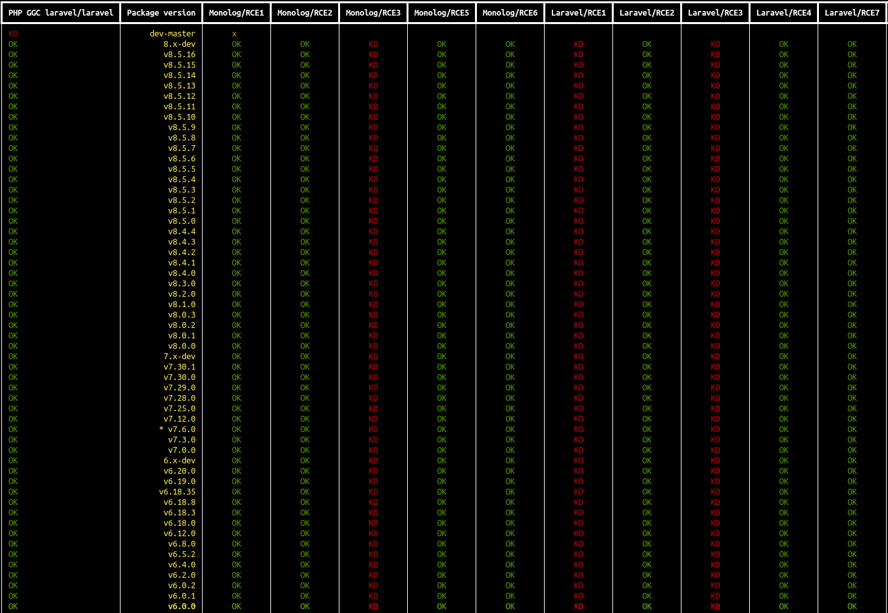
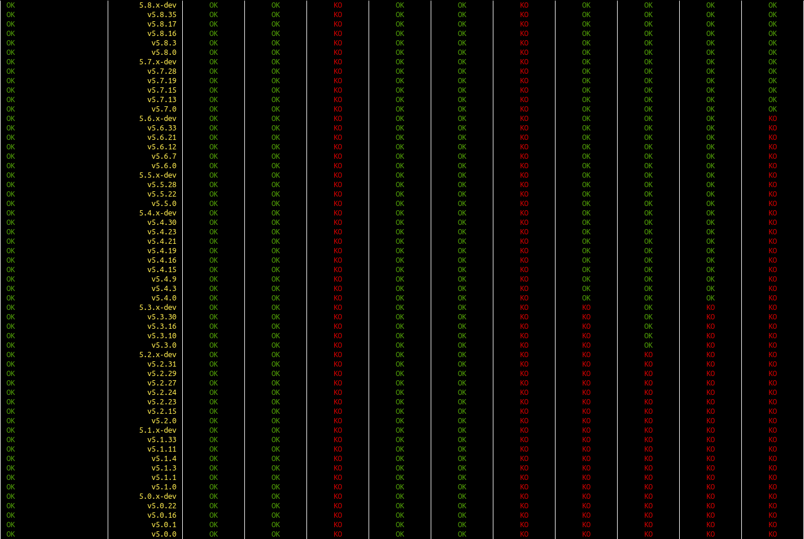
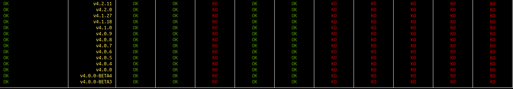
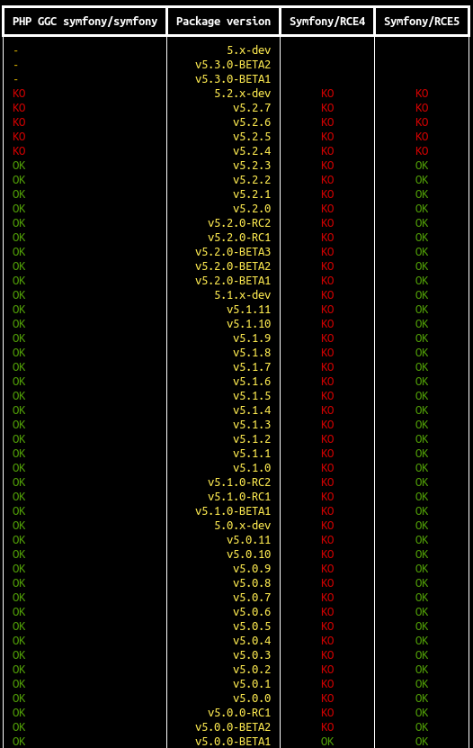
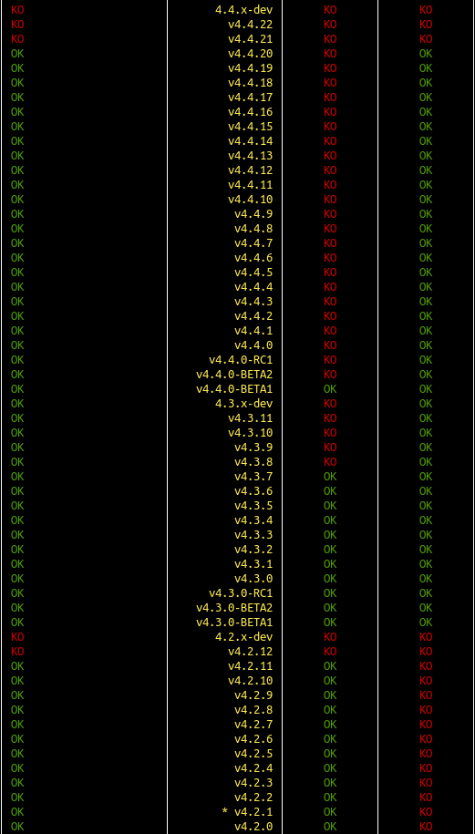
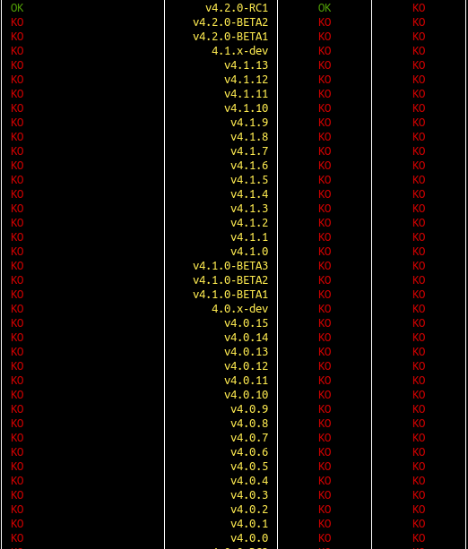

# PHPGGC tester

- quick & dirty POC project to test phpggc payload
- versions and checkout are based on composer
- modify phpggc_tester.py to configure phpggc and composer.phar path, change package to test and rce payloads
- only function call with __destruct vector is supported by now

## results 
- monolog/monolog results :

- laravel/laravel results  (with monolog as it is a requirement of laravel/framework)

- symfony/symfony results : (- means composer error, not tested)

low versions are all KO :(